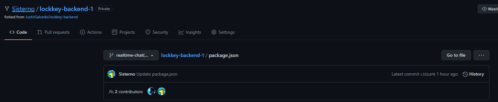
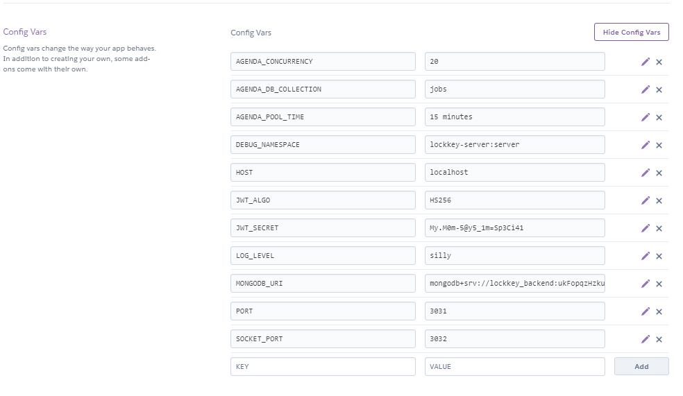

# Deploy
## Deploy en heroku
### Como trabaja heroku?
Los procesos que se pueden realizar en heroku son:
1. Conexión con el repositorio
2. Configuración de variables de entorno
3. Configuración para realizar deploy
4. Configuración para inicialización del proceso

### Conexión con repositorio de GitHub
La conexion con un reporsitorio de github esta limitado a repositorios propios. Al igual que ver y otros servicios de deploy, no se puede conectar con repositorios donde eres colaborador.

Por esta razon, tuve que realizar un fork del repositorio principal.

 

### Variables de entorno

En la parte de **Settings** se puede configurar las variables de entorno. Para hacer esto se tendria que realizar la configuracion de si se esta en produccion, tienes que oviar el archivo .env que estabamos utilizando.

Para este paso, commente la carga del archivo .env . Lo se, esta mal :v

### Deploy y inicialización
Primero, antes que se inicia el proceso de deploy, tenemos que definir cuales seran los scripts de build y de start en ***package.json*** . Primero se ejecutará el script de Build, la teoria de este proceso es el de contruir el proyecto. En este caso, tenemos que compilar el codigo de typescript a javascript y poder correrlo con node.

En el caso del script de start, este sera el script que ejecutara Heroku cada vez que sea necesario reiniciar el proyecto.

> Importante
> Heroku no mantiene el servicio 24/7. Heroku para el proceso para brindar hardware a otras apps. Pero Heroku tiene un proceso de autoinicio, cuando detecte que se esta haciendo una peticion a la app se ejecutara el script de start (por esta razon la primera peticio despues de un tiempo demorara).

